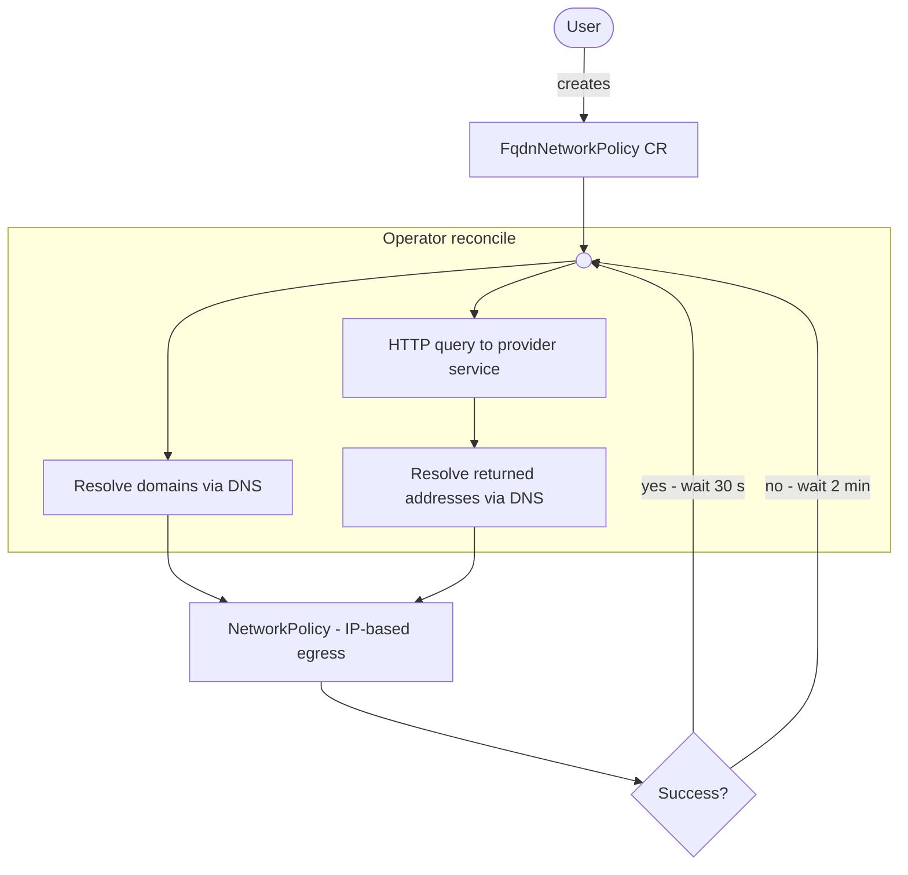

# FQDN Network Policy Operator

A Kubernetes operator that creates and manages `NetworkPolicy` resources with egress rules based on FQDNs (Fully Qualified Domain Names). Because Kubernetes `NetworkPolicy` only supports IP-based egress rules, this operator bridges the gap by continuously resolving domain names to IP addresses and keeping the generated policies up to date.

## How It Works



1. You create a `FqdnNetworkPolicy` custom resource (CR) describing your desired egress rules using domain names, raw IPs/CIDRs, or references to external _provider services_.
2. The operator reconciles the CR every 30 seconds (2 minutes on failure):
   - Resolves each FQDN in `domains` egress items to IP addresses via DNS.
   - Queries any referenced provider services for addresses and ports.
   - Creates or updates a `NetworkPolicy` in the same namespace, owned by the CR (garbage-collected when the CR is deleted).
3. The CR's `status` is updated with the resolved IP count and a `lastReconciled` timestamp.

## Installation

### Helm (recommended)

The chart is published to GHCR as an OCI artifact. Install the latest version with:

```bash
helm install fqdn-networkpolicy-operator \
  oci://ghcr.io/twsouthwick/charts/fqdn-networkpolicy-operator \
  --namespace fqdn-networkpolicy-operator \
  --create-namespace
```

The CRD is bundled in the chart's `crds/` directory and is installed automatically.

To install a specific version:

```bash
helm install fqdn-networkpolicy-operator \
  oci://ghcr.io/twsouthwick/charts/fqdn-networkpolicy-operator \
  --version <semVer> \
  --namespace fqdn-networkpolicy-operator \
  --create-namespace
```

#### Configurable values

| Value | Default | Description |
|---|---|---|
| `replicaCount` | `1` | Number of operator replicas. |
| `image.repository` | `ghcr.io/twsouthwick/fqdn-networkpolicy-operator` | Container image repository. |
| `image.tag` | *(chart appVersion)* | Image tag; defaults to the chart's `appVersion`. |
| `image.pullPolicy` | `IfNotPresent` | Image pull policy. |
| `resources.limits.cpu` | `100m` | CPU limit. |
| `resources.limits.memory` | `128Mi` | Memory limit. |
| `resources.requests.cpu` | `100m` | CPU request. |
| `resources.requests.memory` | `64Mi` | Memory request. |
| `nameOverride` | `""` | Override the chart name portion of resource names. |
| `fullnameOverride` | `""` | Fully override resource names. |

Pass overrides with `--set` or a custom `values.yaml`:

```bash
helm install fqdn-networkpolicy-operator \
  oci://ghcr.io/twsouthwick/charts/fqdn-networkpolicy-operator \
  --namespace fqdn-networkpolicy-operator \
  --create-namespace \
  --set resources.limits.memory=256Mi
```

#### Upgrade and uninstall

```bash
# Upgrade to a newer chart version
helm upgrade fqdn-networkpolicy-operator \
  oci://ghcr.io/twsouthwick/charts/fqdn-networkpolicy-operator \
  --namespace fqdn-networkpolicy-operator

# Uninstall (CRD and CRs are not removed automatically)
helm uninstall fqdn-networkpolicy-operator --namespace fqdn-networkpolicy-operator
```

## Custom Resource: `FqdnNetworkPolicy`

**API group/version:** `fqdnnetpol.swick.dev/v1alpha1`  
**Kind:** `FqdnNetworkPolicy`

### Spec

| Field | Description |
|---|---|
| `spec.policy` | *(required)* A standard `V1NetworkPolicySpec` (podSelector, policyTypes, static egress/ingress rules). Merged with operator-resolved rules. |
| `spec.egress[]` | List of egress rules. Each item is either a domain-based rule or a provider-based rule (see below). |

Each `spec.egress[]` item is **one of**:

**Domain-based rule** — resolved by the operator via DNS:

| Field | Description |
|---|---|
| `spec.egress[].domains` | List of FQDNs or raw IP/CIDR strings. |
| `spec.egress[].ports` | Port/protocol pairs applied to this egress rule. |

**Provider-based rule** — addresses and ports come from an external service:

| Field | Description |
|---|---|
| `spec.egress[].externalProvider` | Reference to a provider service (see [Provider Services](#provider-services)). |

### Status

| Field | Description |
|---|---|
| `status.ready` | Whether the last reconciliation succeeded. |
| `status.ipCount` | Number of IP blocks resolved in the last reconciliation. |
| `status.domainCount` | Number of distinct FQDNs across all domain-based egress rules. |
| `status.warningCount` | Number of non-fatal warnings (e.g. failed DNS lookups). |
| `status.lastReconciled` | Timestamp of the last successful reconciliation. |
| `status.lastModified` | Timestamp of the last time the generated `NetworkPolicy` was actually changed. |
| `status.message` | Human-readable summary of the last reconciliation result. |

### Example

```yaml
apiVersion: fqdnnetpol.swick.dev/v1alpha1
kind: FqdnNetworkPolicy
metadata:
  name: my-egress-policy
  namespace: default
spec:
  egress:
    - domains:
        - google.com
        - api.example.com
      ports:
        - port: 443
          protocol: TCP
        - port: 80
          protocol: TCP
    - externalProvider:
        serviceName: fqdn-provider
        port: 7942
        path: /addresses
  policy:
    podSelector: {}
    policyTypes:
      - Egress
```

This generates a `NetworkPolicy` named `my-egress-policy` with egress rules for the resolved IPs of `google.com` and `api.example.com` on ports 80/443, plus a separate rule from the provider service (which supplies its own addresses and ports).

## Provider Services

A _provider service_ is any HTTP service in the cluster that returns addresses and ports for the operator to allow. This is useful when the set of allowed destinations is managed by another service rather than hard-coded in the CR.

### Response Format

The endpoint must return a JSON object with an `egress` array. Each element groups a set of addresses with the ports they should be reachable on, producing one egress rule per element:

```json
{
  "egress": [
    {
      "addresses": ["example.com", "10.0.0.1/32"],
      "ports": [
        { "port": 443, "protocol": "TCP" },
        { "port": 80, "protocol": "TCP" }
      ]
    }
  ]
}
```

Each entry in `addresses` can be a hostname/FQDN (resolved via DNS), a plain IP, or a CIDR.

### Provider Reference Fields

| Field | Default | Description |
|---|---|---|
| `serviceName` | *(required)* | Kubernetes Service name. The operator calls `http://<serviceName>.<namespace>:<port><path>`. |
| `name` | — | Optional label for logging. |
| `port` | `7942` | Port the service listens on. |
| `path` | `/addresses` | HTTP path that returns the provider response. |

A minimal sample provider is available in the [samples/fqdn-provider](samples/fqdn-provider/) directory.

---

For information on building and contributing to this project, see [DEVELOPMENT.md](DEVELOPMENT.md).
